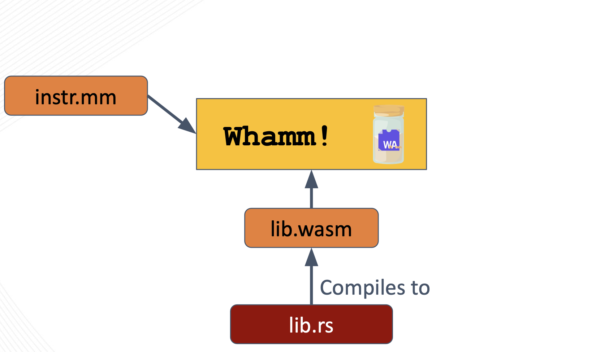

# Getting Started #

Here you will find information on how to begin writing instrumentation in the `Whamm` DSL.

# Installation #
The current way to install `Whamm` is to clone the repository, build the source yourself, and add the created binary to your `PATH` variable.
In the future, users will be able to download pre-built binaries on the GH releases page as we have stable, tagged releases of `Whamm`.

Steps:
1. Clone the [`Whamm` repo](https://github.com/ejrgilbert/whamm)
2. Build the source code with `cargo build`
3. Add the built binary to your `PATH`.
   This binary should be located at `target/debug/whamm`[1](#why_target).

## Basic Test ##
A basic test you can run to make sure that the `Whamm` binary is on your path and working as-expected is running the following command: `whamm --help`. The CLI will provide information on various commands and options available for use.

# Wasm monitors and manipulators #

As mentioned in the [introduction](../intro.md), `Whamm` can be used to either monitor **OR** manipulate a program's execution.

What we mean by **monitor** execution is _collect some information_ about a program's dynamic behavior.
This is commonly used for debugging, logging, and metric collection.

What we mean by **manipulate** execution is to literally _change_ the program's dynamic behavior.
Consider a specific feature of many debugger tools: using a debugger, a developer can set a breakpoint, inspect the current application state, and _change the values of variables_.
This is an example of manipulating an application's dynamic behavior through changing the state and something we will support doing in `Whamm`.

Continue reading through this book's "getting started" content for how to write such _monitors_ and _manipulators_.

# Anatomy of Instrumentation in `Whamm` #

The core anatomy of instrumentation written in `Whamm` consists of the `Whamm` script (`instr.mm`) and the instrumentation library (`instr.wasm`).

Together, these files tell the `Whamm` compiler _where_ to insert instrumentation and _what_ logic to inject at those points.

## `instr.mm`  ##
_**Where** to insert instrumentation._

This `Whamm` script describes a unit of instrumentation by specifying the points to probe in an application using the [probe syntax](./syntax/probes.md).
These probes contain the logic to inject at these match point in their bodies.
This logic _can_ call out to the user's instrumentation library, provided as `lib.wasm`.

## `lib.wasm` ##
_**What** logic to insert at the targeted application points._

It is _optional_ to provide this library to `Whamm`.
It is only necessary if the user would prefer to write their instrumentation in a higher-level language or if the DSL does not have some syntax/tool necessary for the instrumentation logic.
This language _must compile to Wasm_ as the library must be provided to the `Whamm` compiler as a Wasm file.

The user will need to keep in mind that the function signatures in their library that will be called in their probe bodies will need to have types compatible with the [types currently provided](./language.md) by `Whamm`.
Otherwise, `Whamm` will not be able to compile their instrumentation code.

# Helpful Tools #

Here are some tools that may help when working with Wasm:
1. [`wabt`](https://github.com/WebAssembly/wabt), aka the WebAssembly Binary Toolkit
2. [`wasm-tools`](https://github.com/bytecodealliance/wasm-tools)

<a name="why_target">1</a>: We recommend adding the binary built inside `target/` to your path as this will enable you to pull the latest changes on `master`, build the latest version, and automatically have the latest binary on your `PATH`.