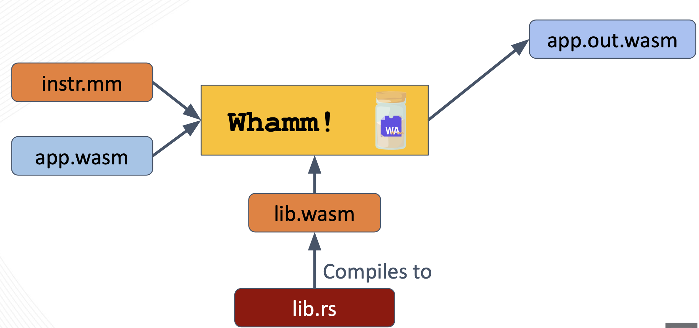
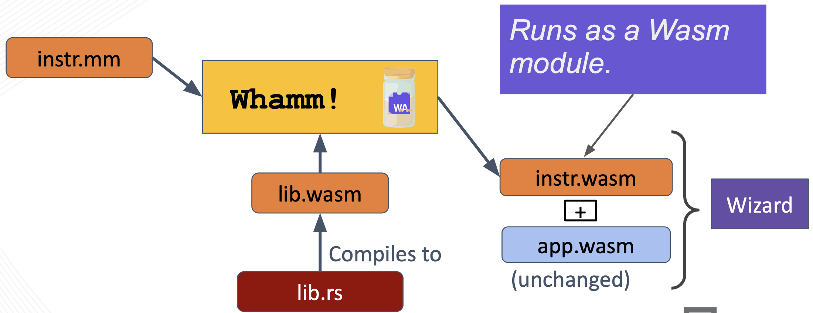

# Injection Strategies #

Debugging and profiling programs are an integral part of engineering software.
This is done through instrumenting the program under observation (inserting instructions that provide insight into dynamic execution).

The most-common instrumentation techniques, such as **bytecode rewriting**, _inject instructions directly into the application code_.
While this method enables instrumentation to support any application domain, it _intrudes_ on the program state space (possibly introducing bugs), complicates the implementation, limits the scope of observation, and cannot dynamically adapt to program behavior.

Instead, one can remedy these issues with bytecode rewriting by **interfacing with a runtime engine** that _directly supports instrumentation_.
This technique can bring powerful capabilities into play as demonstrated by the Wizard research engine, in the ASPLOS paper [Flexible Non-intrusive Dynamic Instrumentation for WebAssembly](https://dl.acm.org/doi/10.1145/3620666.3651338).
This paper demonstrated how to build instrumentation support that protects the application-under-observation, provides consistency guarantees to enable composable tooling, applies JIT optimizations specific to instrumentation that make some tools run even faster than bytecode rewriting, and more.
However, this technique is not as widely-used as bytecode rewriting since it limits a tool's scope to applications that can run on such engines.

This is where `Whamm` comes in.
This DSL abstracts above the instrumentation technique to enable developer tooling to support a broad domain of applications while leveraging runtime capabilities as-available without reimplementation.
With `Whamm` you can _write instrumentation once_ and _support wide domain_ of apps.
_Use engine instrumentation_ capabilities _as available_.
_Use bytecode rewriting_ to support _everything else_.

## Bytecode Rewriting ##

When this strategy is used, the target application bytecode must also be provided to the `Whamm` compiler.
To perform the bytecode rewriting injection strategy, `Whamm` leverages the [`orca`](https://github.com/thesuhas/orca) Rust library.
This library loads the `app.wasm` module into an AST representation that can then be traversed and manipulated to directly inject the instrumentation into the application's bytecode.
Read more about the low-level details in the [developers documentation](../devs/intro.md).

The now-instrumented application is output as a new Wasm module, as shown above (`app.out.wasm`).

## Direct Engine Support ##

Users may also target an engine that directly supports instrumentation via the interface used by `Whamm`.
Currently, the only Wasm engine that does this is [Wizard](https://github.com/titzer/wizard-engine).
You can read about Wizard's instrumentation capabilities in the ASPLOS paper: [Flexible Non-intrusive Dynamic Instrumentation for WebAssembly](https://dl.acm.org/doi/10.1145/3620666.3651338).

The `Whamm` compiler generates a Wasm module that encodes instrumentation in a generic way, it is not directly tied to an application's bytecode.
Read the developer's [Engine Target](../devs/emit/engine_target.md) documentation for more information on how this works if interested.

Note, when using this strategy, the target application's bytecode is _not_ provided to the `Whamm` compiler.
This is because the engine finds the appropriate instrumentation injection points in the application and attaches the appropriate callbacks at application _runtime_.
Thus, the `app.wasm` is provided as a "co-module" (meaning a Wasm module that is directly connected to its supporting `instr.wasm`) to the engine at runtime.
