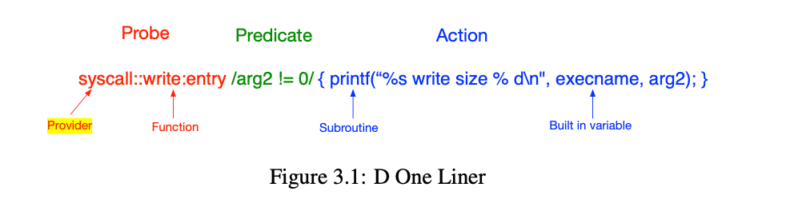

# Grammar

This DSL enables tool implementers to express their instrumentation in terms of program events and corresponding predicated actions; "When _this event_ occurs during program execution, do _these actions_ if _this predicate_ (or conditional) evaluates to true."
This abstraction provides a high-level and intuitive syntax that can target events at various granularities in the instrumented program.

We use the term `probe` to refer to this triple of `event`, `predicate` and `actions`.

The overarching goal of this DSL is to enable tool implementers to write instrumentation in an intuitive way, by express
At a high level, we wish to insert probes into a WebAssembly application, to gain some insights into its execution.
A probe is a location or activity to which Whamm can bind a request to perform a set of actions, like recording a stack trace, a timestamp, or the argument to a function.
Probes are like programmable sensors scattered all over your wasm application in interesting places.

For a comprehensive guide on using DTrace and the D language, see [the Dynamic Tracing Guide](https://illumos.org/books/dtrace/bookinfo.html).

Every whamm clause begins with a list of one or more probe descriptions (red), each taking the usual form: 
*
*provider:module:function:name*
*
